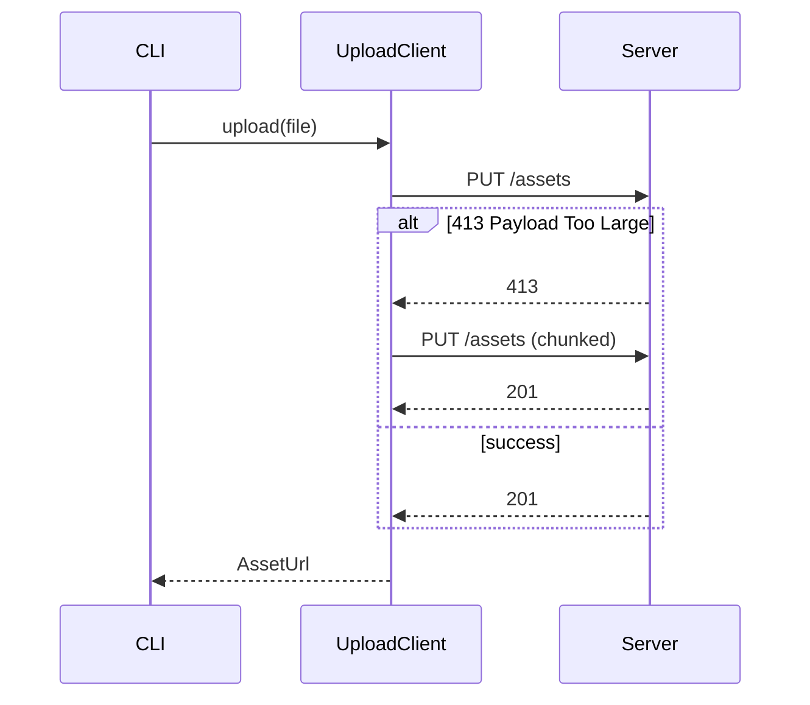

# PR Body Template

Pick sections by what the reviewer needs, not by what the template offers. Do not invent content to fill a heading. A small local change is a `Summary`, a `closes #N` line, and a `Verification` block.

## Summary

Lead with the problem or the capability, then the result and why this approach.

```markdown
## Summary

Uploads over ~10MB failed silently because the client dropped the response body on a 413.
This surfaces the error to the caller and retries once with chunked transfer.

closes #482
```

For a stacked PR add a line such as `Stacked on #480; only the last two commits belong to this PR.`

## Change map

Use when the diff touches several modules or moves responsibility between them. Rows are modules or boundaries, not files.

```markdown
## Change map

| Module | Before | After | Description |
| --- | --- | --- | --- |
| `upload/client` | Swallowed non-2xx responses | Maps 413 to `PayloadTooLarge`, retries once chunked | Callers can distinguish size errors from network errors |
| `cli/upload` | Printed generic "failed" | Prints the mapped error and hint | Actionable output for users |
```

A short responsibility tree helps when the layout itself is the change:

```text
server/
├── routes/      # accept and validate input
├── domain/      # own the invariants
└── adapters/    # talk to external systems
```

## Architecture and behavior

Use a diagram when it explains the change faster than prose. Keep node names tied to real modules or symbols and label arrows with calls, events, or data.

- Module flow (`flowchart LR`) for a cross-module feature or boundary move.
- Sequence diagram for changed ordering, async work, retries, cancellation, or cleanup. Match each `alt` branch to a code branch.
- State diagram for changed transitions or terminal states.

For a fix that changes flow or state, show a `Before` and `After` pair at the same abstraction level, then name the exact edge or step that changed so the reader does not have to diff the diagrams.



When a diagram would be expected but does not apply, say so: `Not applicable: only renames a constant, no runtime flow changes.`

## Boundaries and risks

Use when the change has real failure modes, invariants, migrations, or external effects. Include only rows that matter.

```markdown
## Boundaries and risks

| Invariant or boundary | Failure mode | Protection | Evidence or gap |
| --- | --- | --- | --- |
| Retry happens at most once | Infinite loop on persistent 413 | `attempt` counter, hard cap of 1 | `upload.test.ts` "does not retry twice" |
| Chunked upload is idempotent | Duplicate asset on retry | Server dedupes by content hash | Not verified in this PR |
```

Risk groups to scan: input validation and auth; failure mapping, retries, duplicates, concurrency, ordering, cleanup; schema changes, backfills, rollback; secrets in logs or error payloads; UI loading, error, empty, stale, and repeated-action states.

Write `Not verified` instead of turning a risk question into a claim.

## Visual changes

Only for user-visible UI changes. Image row first, label row second. See [visual-evidence](visual-evidence.md) for capture and attachment.

```markdown
## Visual changes

| Before | After |
| --- | --- |
|  |  |
| Settings / Connection, 1440x900, dark | Settings / Connection, 1440x900, dark |
```

Use `Absent` for a new state and `Removed` for a deleted one.

## Rollout and follow-up

Optional. Migrations, feature flags, staged rollout, monitoring, known gaps, required follow-up PRs. State whether each gap blocks merge.

<!--
Source references:
- https://github.com/moeru-ai/airi/blob/main/.agents/skills/create-pr/references/pr-body.md
-->
